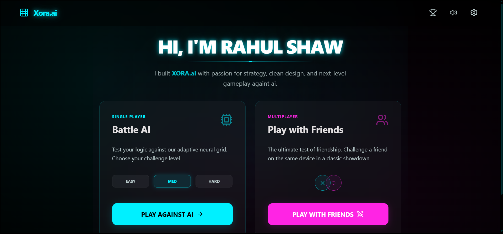
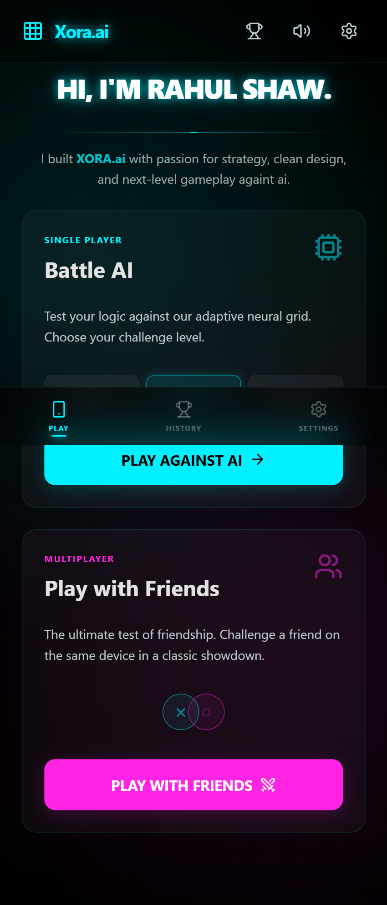
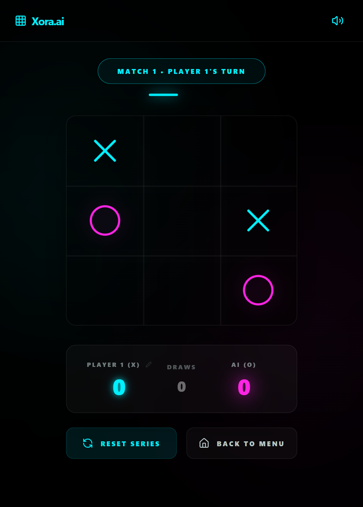

# 🌌 Xora.ai — The Future of Strategic Tic-Tac-Toe

[](https://react.dev/)
[](https://vitejs.dev/)
[](https://tailwindcss.com/)
[](https://opensource.org/licenses/Apache-2.0)

## 🖥️ Desktop Preview

<div align="center">
  
</div>

## 📱 Mobile & Gameplay

<div align="center">
  
  
</div>

**Xora.ai** is a high-fidelity, neon-infused strategic experience that redefines the classic Tic-Tac-Toe game. Designed with a focus on advanced AI algorithms and immersive cyberpunk aesthetics, Xora.ai offers a glimpse into the future of casual gaming.

---

## 🤖 Advanced AI Engine

The core of Xora.ai is its **Adaptive Neural Grid**. Unlike traditional Tic-Tac-Toe games, Xora.ai features a sophisticated AI built on the **Minimax Algorithm** with deep lookahead and heuristic scoring.

### Key AI Features:
- **Neural Strategy:** The AI analyzes every possible game outcome to ensure a perfect defense.
- **Adaptive Difficulty:** 
  - **Easy:** A mix of random moves and basic logic (70% smart).
  - **Medium:** Advanced logic with occasional human-like mistakes (95% smart).
  - **Hard:** A mathematically perfect player. It is impossible to win against the AI on this level; the best you can achieve is a draw.
- **Heuristic Weighting:** The AI prioritizes strategic positions like the center and corners to dominate the board early.

---

## ✨ Features

- **Neon Aesthetics:** A futuristic UI built with Tailwind CSS v4 and Framer Motion for smooth, high-refresh-rate animations.
- **Procedural Audio:** All move sounds and UI interactions are synthesized in real-time using the **Web Audio API**. No heavy assets, just pure math-generated sound.
- **Series Mode:** Play a "Best of 11" series (First to 6 wins). Tracks scores and draws across multiple matches.
- **Battle History:** Persistent local storage keeps track of your past series, winners, and modes.
- **PWA Ready:** Install Xora.ai on your home screen for a full-screen, native-app experience.
- **Custom Winning Sounds:** Unique audio signatures for match wins (`dog.mp3`) and series championships (`faaa.mp3`).

---

## 🛠️ Tech Stack

- **Frontend:** React 19 (TypeScript)
- **Bundler:** Vite 6
- **Styling:** Tailwind CSS 4 (with CSS variables and modern grid layouts)
- **Animations:** Motion (Framer Motion)
- **Audio:** Web Audio API (Procedural) & HTML5 Audio
- **Icons:** Lucide React

---

## 🚀 Getting Started

### Prerequisites
- [Node.js](https://nodejs.org/) (v18 or higher)
- npm or yarn

### Installation

1. Clone the repository:
   ```bash
   git clone https://github.com/CODER-RAHUL9038/XORA.ai.git
   cd XORA.ai
   ```

2. Install dependencies:
   ```bash
   npm install
   ```

3. Run the development server:
   ```bash
   npm run dev
   ```

4. Build for production:
   ```bash
   npm run build
   ```

---

## 📂 Project Structure

```text
F:\XORA\
├── src/
│   ├── assets/          # Audio assets (dog.mp3, faaa.mp3)
│   ├── components/      # UI Components (GameScreen, HomeScreen, Modals)
│   ├── services/        # Logic Layer (AIService, SoundService)
│   ├── App.tsx          # Main State Controller
│   └── main.tsx         # Entry Point
├── public/              # Static assets & PWA icons
└── vite.config.ts       # PWA and Build configuration
```

---

## 👨‍💻 Developed By

**Rahul Shaw**  
*Passionate about strategy, clean design, and next-level gameplay.*

---

## 📄 License

This project is licensed under the Apache-2.0 License.

---

<div align="center">
  <p>Built with ❤️ and AI for the future of gaming.</p>
</div>
